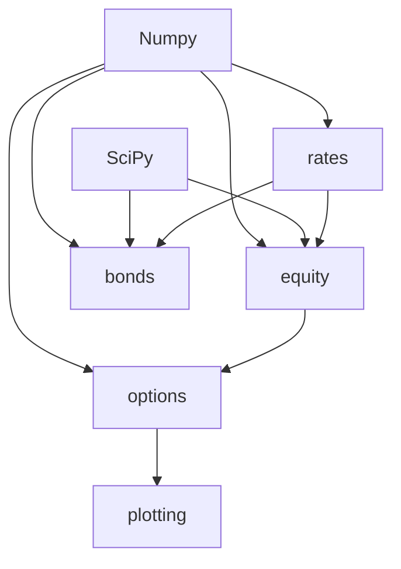

# jj-qfin-math Package Structure Plan

## Overview

This document outlines the proposed package structure for `jj-qfin-math` based on:
1. Current contents in `jj-qfin-math` (BSM, GBM, OptionsGrid)
2. Potential migrations from `jc-hull-derivatives-book` (compounding, fwd, options, pv_dcf, zk)
3. General principles: hierarchical for scale, flat for small, dependency-aware grouping

---

## Proposed Structure

```
src/jj_qfin_math/
├── __init__.py              # Public API exports
├── pyproject.toml           # Dependencies managed here
│
├── rates/                  # Interest rates & discounting
│   ├── __init__.py
│   ├── compounding.py      # [from jc_hull] switch, df_from_rate, rate_from_df
│   ├── fwd.py             # [from jc_hull] forward rates (cc/dc)
│   └── discount.py        # [future] discount factor curves
│
├── bonds/                  # Fixed income
│   ├── __init__.py
│   ├── pv.py              # [from jc_hull] present_value_dcf, bond_*
│   └── zk.py             # [from jc_hull] zero curve bootstrapping
│
├── equity/                 # Equity derivatives
│   ├── __init__.py
│   ├── gbm.py             # [existing] GBM stock price forecast
│   ├── bsm.py             # [existing] Black-Scholes-Merton pricing
│   └── tree.py            # [from jc_hull] binomial trees
│
├── options/                # Options utilities (grid, payoff)
│   ├── __init__.py
│   ├── grid.py            # [existing] OptionsGrid
│   ├── payoff.py          # [from jc_hull] call/put pnl functions
│   └── bounds.py          # [from bsm.py] no-arbitrage bounds (keep with pricing initially)
│
└── plotting/              # Visualization
    ├── __init__.py
    └── payoff.py          # [from jc_hull] TradingPnlPlot
```

---

## Rationale

### 1. Group by Domain, Not by File Size

| Domain | Modules | Dependencies |
|--------|---------|--------------|
| `rates` | compounding, fwd | numpy only |
| `bonds` | pv, zk | rates (compounding) |
| `equity` | gbm, bsm, tree | numpy, scipy |
| `options` | grid, payoff | numpy |
| `plotting` | payoff | matplotlib |

### 2. Migration Candidates from `jc_hull_derivatives_book`

| File | Destination | Reason |
|------|-------------|--------|
| `compounding.py` | `rates/` | Foundational - used by bonds, rates |
| `fwd.py` | `rates/` | Rates domain |
| `pv_dcf.py` | `bonds/pv.py` | Fixed income pricing |
| `zk.py` | `bonds/zk.py` | Fixed income bootstrapping |
| `options.py` (binomial) | `equity/tree.py` | Equity derivatives |
| `pnl_function.py` | `options/payoff.py` | Option position P&L |
| `pnl_plot.py` | `plotting/payoff.py` | Visualization |

### 3. Dependency Graph



### 4. Keep in Root Level

Small utilities that are used everywhere:
- No root-level modules for now
- If you add generic utilities (e.g., `utils.py`, `math_helpers.py`), keep them flat

---

## Key Decisions

1. **Flat vs Hierarchical**: Use hierarchical (`rates/`, `bonds/`, etc.) because:
   - Current scope spans 5+ distinct financial domains
   - Each domain has multiple modules
   - Enables `from jj_qfin_math.rates import compounding` clarity

2. **Subpackage per Domain**: Groups related functionality:
   - `rates/` = interest rates, discounting, forwards
   - `bonds/` = bond pricing, zero curves
   - `equity/` = stock models (GBM), option pricing (BSM, trees)
   - `options/` = option grids, payoff functions
   - `plotting/` = visualization

3. **Avoid Circular Dependencies**:
   - `rates` has no dependencies on other subpackages (foundation)
   - `bonds` depends on `rates` only
   - `equity` depends on numpy/scipy, not other subpackages
   - `options` can use equity pricing without circular imports

---

## Migration Order (When Ready)

1. **Phase 1**: Create `rates/` subpackage (compounding, fwd)
2. **Phase 2**: Create `bonds/` subpackage (pv_dcf → pv, zk)
3. **Phase 3**: Create `equity/` subpackage (move gbm, bsm; add tree)
4. **Phase 4**: Create `options/` subpackage (grid, payoff from pnl_function)
5. **Phase 5**: Create `plotting/` subpackage (payoff plot)

---

## Current Imports After Migration (Example)

```python
# Rates
from jj_qfin_math.rates import compounding, fwd

# Bonds
from jj_qfin_math.bonds import pv, zk

# Equity derivatives
from jj_qfin_math.equity import gbm, bsm, tree

# Options
from jj_qfin_math.options import grid, payoff

# Plotting
from jj_qfin_math.plotting import payoff as payoff_plot
```

---

## Additional Candidates from Other Projects

Scanned other workspace projects for potential code to integrate:

| Project | File | Description | Potential Destination |
|---------|------|-------------|----------------------|
| `jj-portfolio` | `state_transition.py` | Portfolio state transitions with deposits, trades, rebalancing | `portfolio/` |
| `jj-portfolio` | `rebalance.py` | Compute order quantities to rebalance toward target weights | `portfolio/` |
| `jj-simple-sfc` | `economy.py` | AR(1) simulation for price levels, inflation, real activity | `simulation/` or `models/` |
| `position-payoff` | `libs/math.py` | norm_pdf, norm_ppf, erfinv_approx (generic math helpers) | `utils/` or `math/` |

### Potential New Subpackage: `portfolio/`

```
src/jj_qfin_math/portfolio/
├── __init__.py
├── state.py          # [from jj-portfolio] state transitions
└── rebalance.py     # [from jj-portfolio] rebalancing logic
```

**Rationale**: Portfolio theory (mean-variance, rebalancing, position sizing) is distinct from derivatives pricing but related. Could be a separate domain.

### Potential New Subpackage: `simulation/`

```
src/jj_qfin_math/simulation/
├── __init__.py
└── ar1.py           # [from jj-simple-sfc] AR(1) process simulation
```

**Rationale**: Stochastic simulation for economic scenarios, stress testing.

### Potential: `utils/` or `math/` (root level)

- `norm_pdf`, `norm_ppf`, `erfinv_approx` from `position-payoff` - generic enough to live at root

---

## Revised Structure (with new candidates)

```
src/jj_qfin_math/
├── __init__.py
├── pyproject.toml
│
├── rates/                  # Interest rates & discounting
│   ├── __init__.py
│   ├── compounding.py
│   ├── fwd.py
│   └── discount.py
│
├── bonds/                  # Fixed income
│   ├── __init__.py
│   ├── pv.py
│   └── zk.py
│
├── equity/                 # Equity derivatives
│   ├── __init__.py
│   ├── gbm.py
│   ├── bsm.py
│   └── tree.py
│
├── options/                # Options utilities
│   ├── __init__.py
│   ├── grid.py
│   ├── payoff.py
│   └── bounds.py
│
├── portfolio/              # Portfolio management
│   ├── __init__.py
│   ├── state.py
│   └── rebalance.py
│
├── simulation/             # Stochastic simulation
│   ├── __init__.py
│   └── ar1.py
│
├── utils/                  # Generic utilities (math helpers)
│   └── __init__.py
│
└── plotting/               # Visualization
    └── __init__.py
```

---

## Next Steps

1. Review this plan - any concerns with the structure?
2. Decide if/when to start Phase 1 migration
3. Consider if other repos have code to contribute (e.g., `jj-simple-sfc` might have SFC models)
